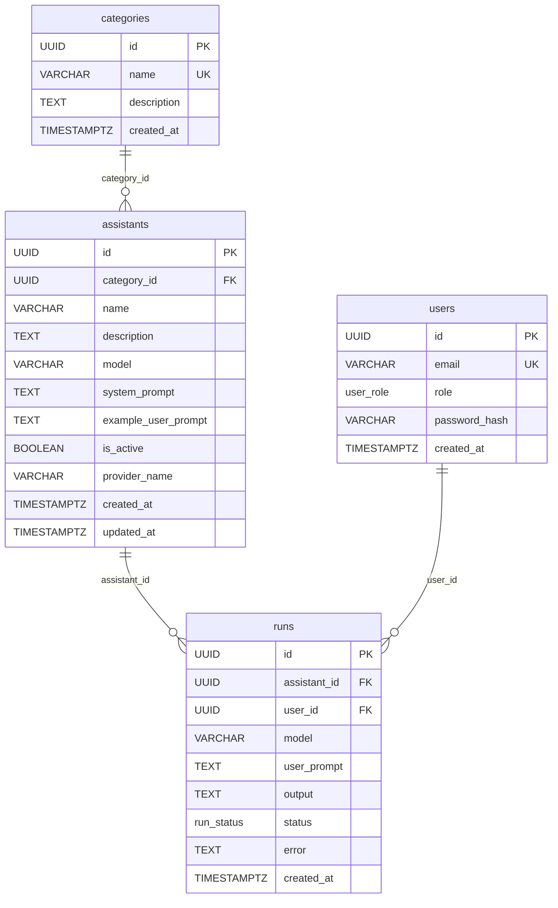

# AI Assistants Catalog

Fullstack-приложение для каталога AI-ассистентов. Backend на Go, frontend SPA на React.

> [!TIP]
> Не хотите ковыряться в репозитории ручками? Задайте вопрос [ассистенту](http://185.112.101.92 )! 

## Стек

**Backend:** Go · PostgreSQL · JWT · chi router  
**Frontend:** BunJS · React 19 · TypeScript · Effector · ReactRouter · Tailwind CSS · shadcn/ui  
**Инфраструктура:** Docker Compose · nginx · GitHub Actions

Bun использовал только для более быстрого билда и тестов, при желании проект легко полностью переносится на NodeJS

## Быстрый старт

```bash
cp .env.example .env
docker compose up --build
```

| Сервис   | Адрес                   |
|----------|-------------------------|
| Frontend | http://localhost:3000   |
| Backend  | http://localhost:8080   |

Healthcheck:

```bash
curl http://localhost:8080/_info
```

## Переменные окружения

Все переменные описаны в `.env.example`. Значимые:

| Переменная              | По умолчанию              | Описание                                    |
|-------------------------|---------------------------|---------------------------------------------|
| `BACKEND_PORT`          | `8080`                    | Порт backend внутри контейнера              |
| `CLIENT_PORT`           | `3000`                    | Внешний порт frontend                       |
| `DATABASE_PORT`         | `5432`                    | Внешний порт PostgreSQL                     |
| `JWT_SECRET`            | `secret`                  | Секрет для подписи JWT                      |
| `PROVIDERS_CONFIG_PATH` | `./backend/providers.yml` | Путь до конфига LLM-провайдеров             |
| `POSTGRES_USER`         | `postgres`                |                                              |
| `POSTGRES_PASSWORD`     | `password`                |                                              |
| `POSTGRES_DB`           | `postgres`                |                                              |

API-ключи провайдеров задаются через переменные окружения, имена которых указаны в `providers.yml` (поле `api_key_env`). Сами ключи **никогда** не хранятся в конфиг-файле.

## Авторизация

Используется `/dummyLogin` — выдаёт JWT для фиксированных тестовых пользователей:

```bash
# Получить токен администратора
curl -X POST http://localhost:8080/dummyLogin \
  -H 'Content-Type: application/json' \
  -d '{"role":"admin"}'

# Получить токен пользователя
curl -X POST http://localhost:8080/dummyLogin \
  -H 'Content-Type: application/json' \
  -d '{"role":"user"}'
```

Тестовые UUID: admin — `00000000-0000-0000-0000-000000000001`, user — `00000000-0000-0000-0000-000000000002`.

## API

### Публичные

| Метод | Путь          | Описание        |
|-------|---------------|-----------------|
| GET   | `/_info`      | Healthcheck     |
| POST  | `/dummyLogin` | Получить JWT    |
| POST  | `/login`      | Логин           |
| POST  | `/register`   | Регистрация     |

### Защищённые (Bearer JWT)

| Метод | Путь                            | Роль    | Описание                      |
|-------|---------------------------------|---------|-------------------------------|
| GET   | `/providers`                    | any     | Список LLM-провайдеров        |
| GET   | `/categories`                   | any     | Список категорий              |
| POST  | `/categories`                   | admin   | Создать категорию             |
| GET   | `/assistants`                   | any     | Список ассистентов            |
| POST  | `/assistants`                   | admin   | Создать ассистента            |
| GET   | `/assistants/:id`               | any     | Карточка ассистента           |
| PUT   | `/assistants/:id`               | admin   | Обновить ассистента           |
| POST  | `/assistants/:id/run`           | any     | Запустить ассистента          |
| GET   | `/runs/my`                      | any     | Мои запуски                   |
| GET   | `/admin/runs`                   | admin   | Все запуски                   |

Параметры фильтрации `GET /assistants`: `page`, `pageSize`, `q` (полнотекстовый поиск), `categoryId`, `includeInactive` (только admin).

## Архитектурные решения

### Схема БД



### Backend


Трёхслойная архитектура: `handler → service → repository`. Интерфейсы объявляются на стороне потребителя — сервисы не зависят от конкретных реализаций репозиториев и LLM-провайдера, что упрощает тестирование через моки.

Доменные ошибки (`ErrNotFound`, `ErrAssistantInactive`, `ErrLLMProvider` и др.) объявлены в `domain/errors.go` и проверяются через `errors.Is` на уровне хендлеров — HTTP-статусы выставляются там, а не в бизнес-логике.

Системный промпт скрывается от роли `user` на уровне хендлера. Флаг `includeInactive` для не-admin принудительно сбрасывается там же.

Полнотекстовый поиск по ассистентам реализован через `websearch_to_tsquery('russian', ...)` с GIN-индексом. История запусков индексирована по `(user_id, created_at DESC)`.

### Frontend

Чистый CSR SPA: ReactRouter + Effector (для серверного стейта) Глобальный стейт (токен, роль) — в `sessionStorage`

API-слой разделён на три уровня: `fetcher` (HTTP + обработка ошибок) → `client` (доменные функции) → `hooks` (интеграция с React Query). Компоненты зависят только от хуков.

Запросы к backend проксируются через nginx (`/api/` → `http://backend:8080/`), поэтому в коде используется относительный базовый путь `/api` без хардкода хоста.

### LLM Provider

Провайдеры настраиваются декларативно через `providers.yml`. Backend при старте парсит этот файл, создаёт экземпляры провайдеров и регистрирует их в `ProviderRegistry`. Каждый ассистент может использовать свой провайдер — имя провайдера хранится в колонке `provider_name`.

Интерфейс провайдера в домене:

```go
type LLMProvider interface {
    Complete(ctx context.Context, req LLMRequest) LLMResponse
    CompleteStream(ctx context.Context, req LLMRequest) LLMResponseStream
}

type ProviderRegistry interface {
    Get(name string) (LLMProvider, error)
    Exists(name string) bool
}
```

**Конфиг провайдеров** (`backend/providers.yml`):

```yaml
providers:
  - name: mock
    type: mock
    models:
      - mock-model

  - name: deepseek
    type: openai
    base_url: https://api.deepseek.com/v1
    api_key_env: DEEPSEEK_API_KEY
    models:
      - deepseek-chat
      - deepseek-reasoner
```

**Типы провайдеров:**
- `mock` — детерминированный, всегда доступен, отвечает в формате `[mock] model=<model> | <userPrompt>`
- `openai` — OpenAI-совместимый, требует `base_url` и `api_key_env`. Ключ читается из переменной окружения, имя которой указано в `api_key_env`

**Поведение при старте:**
- Если конфиг-файл отсутствует или содержит ошибки — backend паникует
- Если для провайдера не задан API-ключ (env-переменная пуста) — провайдер регистрируется как недоступный (`available: false`), backend продолжает работу
- Неизвестный тип провайдера — логируется и пропускается

Таймаут LLM-вызова — 30 секунд (задаётся через `context.WithTimeout` в `RunService`).

Список провайдеров доступен через `GET /providers` — возвращает имя, тип, список моделей и флаг доступности каждого провайдера. Фронтенд использует этот эндпоинт для отображения выпадающих списков провайдера и модели в форме создания/редактирования ассистента.

OpenAI-провайдер проверен на Groq, Gigachat и DeepSeek

## Поведение запуска ассистента

1. Проверяется существование и активность ассистента
2. Запуск сохраняется в БД со статусом `pending`
3. Вызывается LLM provider с `model`, `systemPrompt`, `userPrompt`
4. При успехе — статус `success`, результат сохраняется
5. При ошибке или таймауте — статус `failed`, сообщение об ошибке сохраняется

Все запуски сохраняются независимо от результата.

## Тесты

```bash
# Unit-тесты backend
cd backend && go test ./internal/... -v

# E2E-тесты backend (требуют запущенный PostgreSQL)
cd backend && go test ./tests/e2e/... -v -timeout 120s

# Тесты backend через Docker Compose (изолированная БД)
docker compose -f docker-compose.test.yml up --build --remove-orphans

# Тесты frontend
cd client && bun test
```

E2E-тест воспроизводит полный сценарий: создание ассистента администратором → запуск пользователем → проверка истории.

## Нагрузочное тестирование

Нагрузочный тест проводился для эндпоинта `POST /assistants/{id}/run` 
с использованием [k6](https://k6.io). Mock LLM-провайдер настроен 
с задержкой 800ms для симуляции реального LLM API.

### Конфигурация теста

- Инструмент: k6
- Эндпоинт: `POST /assistants/{id}/run`
- VU (виртуальные пользователи): до 400
- Длительность: ~2 минуты
- Mock LLM latency: 800ms

### Результаты

| Метрика        | Значение            |
|----------------|---------------------|
| Всего запросов | 29 867              |
| Успешных       | 100% (0 ошибок)     |
| Пиковый RPS    | ~340 RPS            |
| Средний RPS    | ~247 RPS            |
| p(50) latency  | 805ms               |
| p(90) latency  | 815ms               |
| p(95) latency  | 823ms               |
| p(95) порог    | < 1000ms            |
| Error rate     | 0.00% (порог < 1%)  |

### Выводы

Оба threshold пройдены с запасом:
- p(95) = 823ms при пороге 1000ms — **запас 177ms**
- Error rate = 0.00% при пороге 1% — **нулевая ошибочность**

Реальный overhead бекенда (без LLM latency) составляет ~8ms на запрос,
что подтверждается разницей между средним временем ответа (808ms)
и задержкой мока (800ms).

### Поведение под нагрузкой (Grafana)

- **Горутины**: пик ~680 при ~340 RPS, после нагрузки возврат к baseline —
  утечек горутин нет
- **Память**: ~50MB total при пиковой нагрузке, стабильна после теста —
  утечек памяти нет
- **GC**: duration на пике ~0.014ms — GC-паузы незначительны
- **SQL**: три ключевых запроса (INSERT runs, SELECT assistants, UPDATE runs)
  выполняются за 0.07–0.23ms каждый

### Запуск теста
установить k6: https://k6.io/docs/getting-started/installation/
```bash
k6 run backend/tests/load/test.js
```

Мониторинг во время теста доступен в Grafana на `http://localhost:3001`

Скриншоты из Grafana во время тестирования:


## CI

GitHub Actions запускает при каждом пуше и PR в `main`:

- **test-backend** — unit + E2E тесты с реальным PostgreSQL
- **lint-backend** — golangci-lint
- **test-frontend** — vitest + tsc --noEmit
- **lint-frontend** — eslint + prettier
- **build** — `docker compose up --build`, healthcheck `/_info` и фронтенда
- **load-test** — нагрузочные тесты на низких RPS (~15)

## Roadmap и технический долг

Хочу доработать проект, ниже идеи для улучшения, отсортированные по приоритетам

### High Priority 
- [x] **Рефакторинг обработки ошибок (Go):** Сделать явный проброс типизированных доменных ошибок (`domain/errors.go`) до слоя хендлеров для формирования консистентных `ErrorResponse` во всех хендлерах и сервисах, сейчас некоторые ошибки утекают на клиента в голом виде (например ошибки LLM провайдеров).
- [x] **Покрытие тестами:** Увеличение покрытия юнит-тестами бизнес-логики до 80%+ и внедрение нагрузочного тестирования, чтобы убедиться что приложение соответствует требованиям по RPS и SLI.

### Medium Priority
- [x] **Гибкая настройка LLM:** Реализация динамического выбора провайдера. Провайдеры настраиваются в `providers.yml`, каждый ассистент может использовать свой провайдер (Mock, DeepSeek, OpenAI-совместимые).
- [ ] **Улучшение UX поиска и навигации:** 
  - [x] Переход от строгого полнотекстового поиска к поиску по частичным вхождениям (улучшение UX при опечатках).
  - [ ] Внедрение системы тегов для гибкой фильтрации ассистентов в каталоге.

### Low Priority
- [x] **Поддержка MCP:** Интеграция протокола для предоставления ассистентам доступа к файловой системе и поддержки скиллов.
- [x] **Стриминг ответов:** Расширение интерфейса `LLMProvider` для поддержки SSE при генерации ответов.
